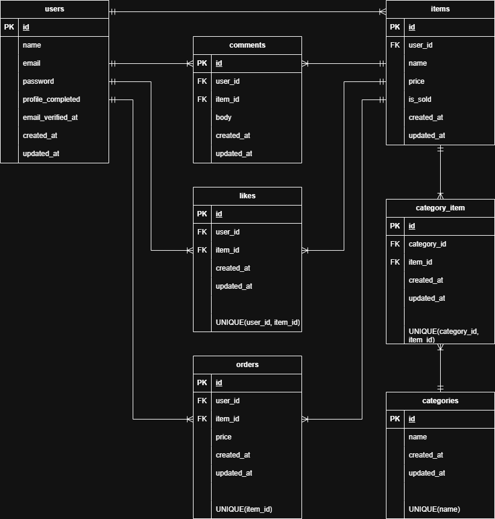

# flea-market-mock-app

---

## 環境構築

### Docker ビルド

```bash
docker-compose up -d --build
```

---

### Laravel 環境構築

1. PHP コンテナに入る。

```bash
docker-compose exec php bash
```

2. Laravel に必要なパッケージをインストールする。

```bash
composer install
```

3. 環境変数ファイルを作成する。

```bash
cp .env.example .env
```

※ `.env`ファイル内の環境変数（DB 接続情報など）は、環境に合わせて適宜変更してください。

4. アプリケーションキーを生成する。

```bash
php artisan key:generate
```

※ Laravel の暗号化機能を利用するために必要な設定です。

5. データベースのマイグレーション・シーディングを実行する。

```bash
php artisan migrate --seed
```

※ テーブル作成（migration）とダミーデータ作成（seeding）を同時に実行します。

6. ストレージのシンボリックリンクを作成する（画像表示に必要）

```bash
php artisan storage:link
```

---

## Stripe決済機能について

本アプリでは Stripe Checkout を利用した決済機能を実装しています。

### 対応支払い方法

- カード決済
- コンビニ決済

### Stripeキーの設定

`.env` に以下を追加してください。

```env
STRIPE_SECRET=sk_test_xxxxxxxxxxxxx
```

### テスト環境について

PHPUnit 実行時は外部API通信を行わないように制御しています。  
そのためテストは正常に通ります。

---

## 使用技術(実行環境)

- Docker
- PHP 8.1.33
- Laravel 8.83.29
- MySQL 8.0.26
- nginx 1.21.1
- Laravel Fortify
- Stripe Checkout
- PHPUnit
- JavaScript(Plain JavaScript)
- Mailhog

---

## ER 図



---

## テスト

PHPUnitによる機能テストを実装済み。

```bash
docker-compose exec php vendor/bin/phpunit
```

### テスト用アカウント

以下のアカウントをシーダーで作成しています。

- 出品者A
　email: seller_a@example.com
　password: password

- 出品者B
　email: seller_b@example.com
　password: password

※`php artisan migrate --seed`実行後にログイン可能です。

---

## URL

- 商品一覧：http://localhost/
- 商品詳細：http://localhost/item/{item_id}
- 商品出品：http://localhost/sell
- マイページ：http://localhost/mypage
- プロフィール編集：http://localhost/mypage/profile
- 購入ページ：http://localhost/purchase/{item_id}
- 会員登録：http://localhost/register
- ログイン：http://localhost/login
- phpMyAdmin(DB確認用)：http://localhost:8080
- メール確認(Mailhog)：http://localhost:8025